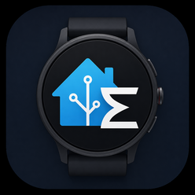

# zepp-hass-sync



A Zepp OS watch app that pushes health/fitness data to
[zepp2hass](https://github.com/davidepalleschi/zepp2hass), a Home Assistant custom
integration, via its webhook.

[zepp2hass](https://github.com/davidepalleschi/zepp2hass) ships its own companion
Zepp Store watch app to feed it data, but that app currently crashes on launch, its
source isn't public, and the issue has never been fixed. zepp-hass-sync is an
independent, open-source replacement for that watch app, built to send the same
webhook payload shape so it drops in as a working substitute.

See [TUTORIAL.md](TUTORIAL.md) for install and configuration instructions.

## ⚠️ Stability of the current version

The current version (1.3.x) reworks the watch screen and moves automatic sending
onto an alarm-woken background service. **On the Amazfit GTR 4 it appears
unstable**: automatic sends can stop or arrive irregularly, because each
alarm-driven run is a *single execution* the system caps at 600 ms, while a BLE
round trip to the phone takes seconds — see the analysis at the top of
[app-service/index.js](app-service/index.js#L34-L60). Manual **Send now** is not
affected.

No other watch model has been tested on this version. If you run it on one, please
report what you see so the table below can be filled in.

## How it works

Two different things travel over Bluetooth, and the app never calls them the same
name:

- **send** — health data going out to Home Assistant, the app's actual job;
- **config** — the watch pulling `{ interval, webhook set? }` back from the phone,
  which is cheap, one-directional, and moves no health data.

**Watch side.** One screen: a large **Send now** button, and under it a coloured dot
beside the time of the last send — green sent, red failed, amber no webhook set,
grey nothing yet — with a wrapped line that carries the error text and stays empty
when there is nothing to explain. Config state and its **Refresh config** button sit
below, deliberately smaller. The watch reads every available sensor and hands the
values to the phone over BLE; no diagnostics are drawn on the watch face any more.
The UI is translated into six languages.

**Phone side.** The companion app-side code running in the Zepp app formats the
payload to the zepp2hass JSON shape and POSTs it to the webhook URL configured in the
Settings screen (no URL configured → the app reports "Webhook not set" instead of
sending). That Settings screen is the only place the
webhook URL and the interval are edited; the watch reads them and never writes them
back. A collapsed **Debug** panel holds the authoritative record: the outcome and
full, untruncated error of the last send the phone handled, plus the background
service's own history.

**Automatic sending.** A system alarm is the clock: it wakes a background
`app-service`, which arms the next alarm, sends once, and ends itself — nothing stays
running in between. Alarms survive a reboot, and opening the app re-arms them. The
background service cannot write watch-side storage, so the phone reports each
background outcome back in the reply to the next exchange, and the watch merges it
with its own record, later timestamp winning.

## Compatible Devices

`Implemented` means a layout and target exist for the device. `Tested` means someone
actually ran the app on the hardware.

| Device | Implemented | Tested (≤ 1.2) | Tested (1.3.x) |
| --- | --- | --- | --- |
| Amazfit GTR 4 (Zepp OS 3.0 / 3.5) | ✅ | ✅ | ⚠️ unstable (see above) |
| Amazfit T-Rex 3 / T-Rex 3 Pro | ✅ | ✅ | ❌ |
| Amazfit Active Max | ✅ | ✅ | ❌ |
| Amazfit Balance 3 / Balance 3 Ti | ✅ | ❌ | ❌ |
| Amazfit Balance Ultra | ✅ | ❌ | ❌ |
| Amazfit Cheetah 2 Ultra | ✅ | ❌ | ❌ |
| Amazfit Bip Max | ✅ | ❌ | ❌ |
| Amazfit Cheetah 2 Pro | ✅ | ❌ | ❌ |
| Amazfit T-Rex Ultra 2 | ✅ | ❌ | ❌ |
| Amazfit Active 3 Premium | ✅ | ❌ | ❌ |
| Amazfit Active 2 (Round) | ✅ | ❌ | ❌ |
| Amazfit Bip 6 | ✅ | ❌ | ❌ |
| Amazfit Balance 2 / Balance 2 XT | ✅ | ❌ | ❌ |
| Amazfit Rome | ✅ | ❌ | ❌ |
| Amazfit GTR 4 Limited Edition | ✅ | ❌ | ❌ |
| Amazfit GTS 4 | ✅ | ❌ | ❌ |
| Amazfit Balance | ✅ | ❌ | ❌ |
| Amazfit Cheetah / Cheetah Pro / Cheetah (Square) | ✅ | ❌ | ❌ |
| Amazfit T-Rex Ultra | ✅ | ❌ | ❌ |
| Amazfit Falcon | ✅ | ❌ | ❌ |
| Amazfit Active Edge | ✅ | ❌ | ❌ |
| Amazfit Bip 5 Unity / Core | ✅ | ❌ | ❌ |

This table will be updated as the app is released and tested on more devices.

## Development

```bash
npm install
npm test     # vitest
npm run lint # eslint
```

See [CONTRIBUTING.md](CONTRIBUTING.md).
